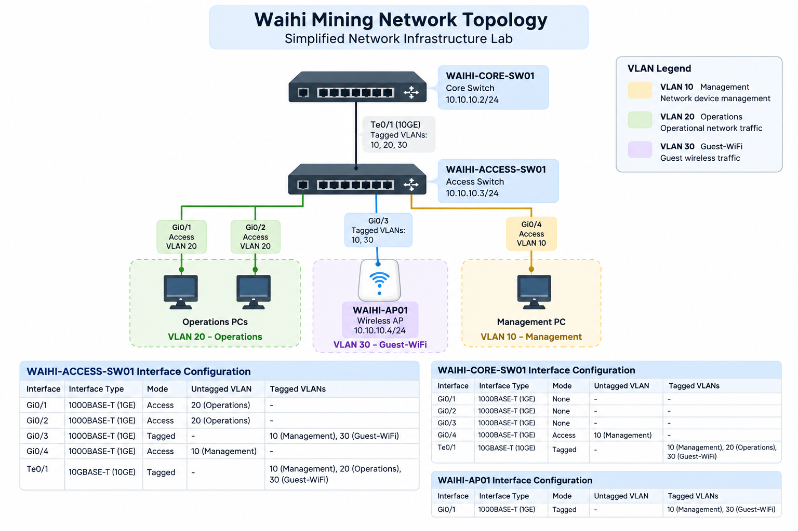

# Waihi Mining Network Infrastructure Lab

A small network infrastructure automation project built with NetBox and Python.

This project models a simplified mining-site network in NetBox and uses the NetBox REST API to automatically retrieve infrastructure data and generate network inventory reports.

## Project Overview

The lab represents a simplified network environment containing:

- 1 Core Switch
- 1 Access Switch
- 1 Wireless Access Point
- 3 VLANs
- Management IP addressing
- Access and tagged/trunk interfaces

NetBox is used as the source of truth for the network infrastructure.

A Python script connects to the NetBox REST API and retrieves information about:

- Devices
- Interfaces
- VLAN assignments
- Interface modes
- IP addresses
- DNS names

The retrieved data is then exported into CSV inventory reports.


## Network Topology



### Devices

| Device | Role | Management IP |
|---|---|---|
| WAIHI-CORE-SW01 | Core Switch | 10.10.10.2/24 |
| WAIHI-ACCESS-SW01 | Access Switch | 10.10.10.3/24 |
| WAIHI-AP01 | Wireless AP | 10.10.10.4/24 |

### VLANs

| VLAN | Name | Purpose |
|---|---|---|
| 10 | Management | Network device management |
| 20 | Operations | Operational network traffic |
| 30 | Guest-WiFi | Guest wireless traffic |

## Automation

The Python script communicates with NetBox using its REST API.

The script retrieves infrastructure data from:

- DCIM Devices
- DCIM Interfaces
- IPAM VLANs
- IPAM IP Addresses

A reusable API function is used to retrieve data from NetBox endpoints with basic error handling.

## Generated Reports

Running the script generates:

### `devices.csv`

Contains:

- Device name
- Device role
- Status
- Device type

### `network_inventory.csv`

Contains:

- Device
- Interface
- Interface type
- Interface mode
- Untagged VLAN
- Tagged VLANs

## Technologies

- Python
- NetBox
- REST API
- Requests
- python-dotenv
- CSV
- Git

## Security

NetBox credentials and API tokens are stored in a local `.env` file.

The `.env` file is excluded from version control using `.gitignore`, preventing API credentials from being committed to the repository.


## Running the Project

Install the required Python packages:

```bash
pip install requests python-dotenv
```

Create a `.env` file:

```env
NETBOX_URL=http://localhost:8000
NETBOX_TOKEN=your_netbox_api_token
```

Run the inventory script:

```bash
python netbox_report.py
```

The script retrieves the latest infrastructure information from NetBox and generates the CSV inventory reports.

## What I Learned

This project provided practical experience with:

- Modelling network infrastructure in NetBox
- VLAN and interface configuration
- IP address management
- Working with REST APIs
- API authentication
- Python automation
- Environment variables and credential management
- Generating infrastructure inventory reports from a source of truth